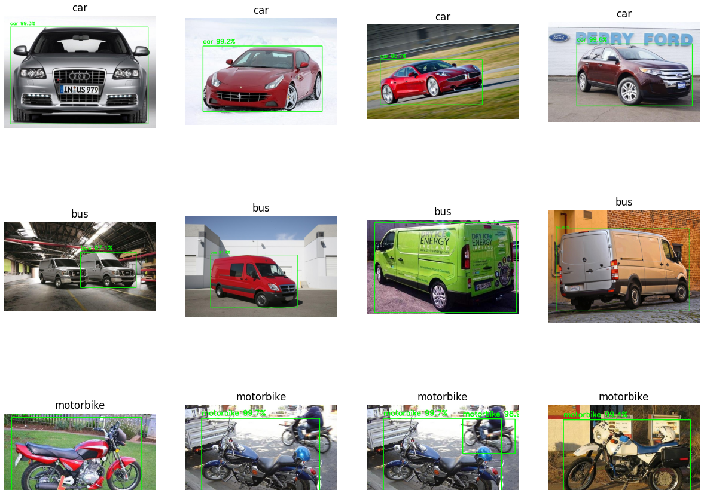
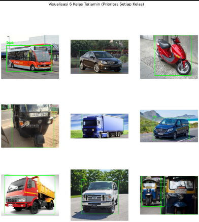

# 🚗🚌🏍️ YOLOv8 Vehicle Object Detection

Sistem **deteksi objek kendaraan berbasis YOLOv8** untuk mengenali beberapa jenis kendaraan secara otomatis menggunakan **computer vision**. Proyek ini mencakup proses persiapan dataset, training model, evaluasi performa, hingga visualisasi hasil deteksi dengan bounding box dan confidence score.

> Proyek dikembangkan sebagai bagian dari tugas **Artificial Intelligence (UAS)**.

---

## 📌 Project Overview

Proyek ini menggunakan **YOLOv8** untuk mendeteksi dan mengklasifikasikan objek kendaraan pada gambar.

Model dilatih untuk mengenali **6 kelas kendaraan**:

- 🚌 Bus
- 🚗 Car
- 🏍️ Motorbike
- 🛺 Rickshaw
- 🚚 Truck
- 🚐 Van

Hasil deteksi ditampilkan menggunakan **bounding box** beserta **confidence score** untuk menunjukkan objek dan tingkat keyakinan model terhadap prediksinya.

---

## 📊 Dataset

Dataset yang digunakan merupakan **Vehicle Object Dataset** dalam format YOLO.

| Komponen | Detail |
|---|---|
| Sumber | Vehicle Object Dataset |
| Format | YOLO |
| Training Images | 2.062 |
| Validation Images | 873 |
| Jumlah Kelas | 6 |

🔗 **Dataset:**  
[Vehicle Object Dataset – Roboflow](https://universe.roboflow.com/nadin-pethiyagoda/vehicle-dataset-for-yolo)

### Class Mapping

| Class ID | Label |
|---:|---|
| 0 | Bus |
| 1 | Car |
| 2 | Motorbike |
| 3 | Rickshaw |
| 4 | Truck |
| 5 | Van |

---

## 🧹 Data Preparation

Tahap persiapan data dilakukan sebelum proses training model, meliputi:

- Memeriksa jumlah gambar dan label pada dataset.
- Memastikan struktur dataset sesuai dengan format YOLO.
- Memeriksa konsistensi antara gambar dan file label.
- Menyiapkan konfigurasi `data.yaml` untuk mendefinisikan 6 kelas kendaraan.
- Membagi data menjadi training dan validation untuk proses pembelajaran dan evaluasi model.

---

## 🧠 Model & Training

| Parameter | Konfigurasi |
|---|---|
| Model | YOLOv8 Nano (`yolov8n`) |
| Framework | Ultralytics |
| Epochs | 5 |
| Image Size | 640 × 640 |
| Batch Size | 16 |
| Environment | Google Colab |
| Language | Python |

Model dilatih menggunakan **transfer learning** dari bobot awal YOLOv8 untuk menyesuaikan model dengan karakteristik dataset kendaraan.

---

## 📈 Model Evaluation

Performa model dievaluasi menggunakan beberapa metrik utama:

- **Precision** — mengukur ketepatan prediksi positif model.
- **Recall** — mengukur kemampuan model menemukan objek yang sebenarnya ada.
- **mAP@0.5** — evaluasi mean Average Precision pada IoU 0.5.
- **mAP@0.5:0.95** — evaluasi pada rentang IoU 0.5 hingga 0.95.

### Training Metrics


Grafik menunjukkan perkembangan **loss, precision, recall, dan mAP** selama proses training dan validation.

---

## 🖼️ Detection Results

Berikut merupakan contoh hasil inferensi model pada gambar kendaraan.



Model menampilkan:

- **Bounding box** untuk lokasi objek.
- **Label kelas kendaraan**.
- **Confidence score** untuk setiap prediksi.

---

## 🔬 Visualisasi Dataset

Contoh data training dari berbagai kelas kendaraan digunakan untuk melihat karakteristik dataset dan memastikan objek yang digunakan dalam proses pembelajaran.



---

## 🛠️ Tools & Technologies

- **Python**
- **YOLOv8**
- **Ultralytics**
- **OpenCV**
- **Matplotlib**
- **Google Colab**

---

## 📁 Project Structure

```text
YOLOv8-Vehicle-Object-Detection/
│
├── Images/
│   ├── Hasil_Deteksi_Yolo.png
│   ├── Grafik_Training_Yolo.png
│   └── Visualisasi_6_Kelas.png
│
├── README.md
└── YOLOv8_Vehicle_Object_Detection.ipynb
