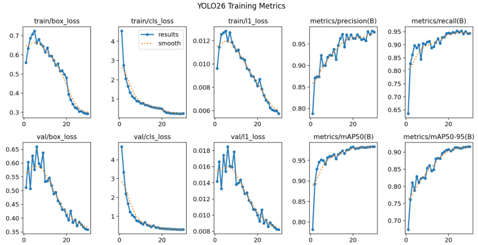
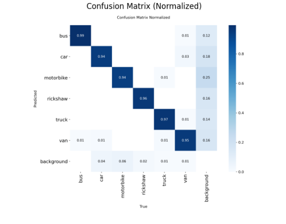
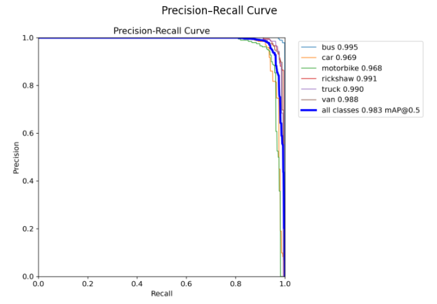
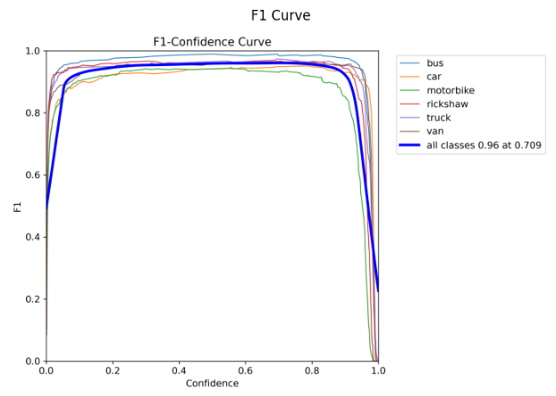
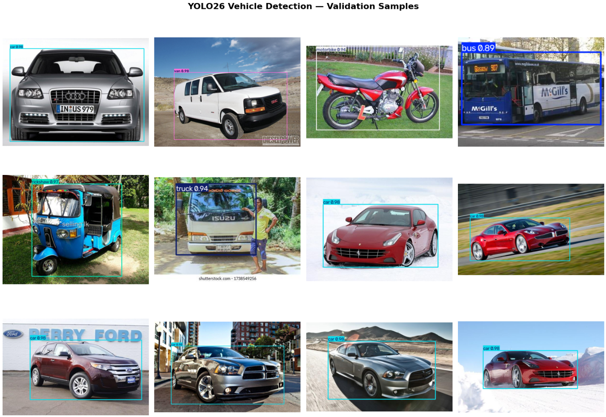

# 🚗🚌🏍️ YOLO26 Vehicle Object Detection

A computer vision project for detecting and classifying **6 vehicle classes** using **YOLO26 Nano**. The project covers dataset auditing, model fine-tuning, evaluation, and visual analysis of object detection results.

The model is trained to identify:

- 🚌 Bus
- 🚗 Car
- 🏍️ Motorbike
- 🛺 Rickshaw
- 🚚 Truck
- 🚐 Van

---

## 📌 Project Overview

This project implements an object detection pipeline using **YOLO26 Nano (`yolo26n.pt`)** with a custom vehicle dataset.

The workflow includes:

1. Dataset auditing and validation
2. Dataset preparation in YOLO format
3. Transfer learning from a pretrained YOLO26 model
4. Model fine-tuning
5. Validation and performance evaluation
6. Per-class performance analysis
7. Visual inspection of detection results
8. Inference performance analysis

The goal is to build a lightweight vehicle detection model capable of recognizing multiple vehicle categories from images.

---

## 📊 Dataset

The project uses a vehicle object detection dataset in **YOLO format**.

| Component | Detail |
|---|---|
| Dataset Type | Vehicle Object Detection |
| Format | YOLO |
| Training Images | 2,062 |
| Validation Images | 873 |
| Training Objects | 2,637 |
| Validation Objects | 1,114 |
| Number of Classes | 6 |

### 🔗 Dataset Source

The dataset is publicly available through Roboflow Universe:

**[Vehicle Object Dataset – Roboflow](https://universe.roboflow.com/nadin-pethiyagoda/vehicle-dataset-for-yolo)**

### Class Mapping

| Class ID | Class |
|---:|---|
| 0 | Bus |
| 1 | Car |
| 2 | Motorbike |
| 3 | Rickshaw |
| 4 | Truck |
| 5 | Van |

---

## 🧹 Dataset Preparation & Auditing

Before training, the dataset was audited to verify its structure and annotation consistency.

The preparation process included:

- Checking the number of training and validation images.
- Verifying image and label availability.
- Checking the YOLO annotation format.
- Reviewing class distribution.
- Validating the dataset configuration through `data.yaml`.
- Visualizing representative samples from the six classes.

This step helps reduce dataset-related issues before model training.

---

## 🧠 Model & Training

The model was fine-tuned using a pretrained **YOLO26 Nano** model.

| Parameter | Configuration |
|---|---|
| Model | YOLO26 Nano (`yolo26n.pt`) |
| Task | Object Detection |
| Framework | Ultralytics |
| Image Size | 640 × 640 |
| Maximum Epochs | 30 |
| Early Stopping | Patience = 8 |
| Optimizer | Auto (MuSGD for YOLO26) |
| Seed | 42 |
| Hardware | NVIDIA T4 GPU |
| Environment | Google Colab |
| Language | Python |

### Training Strategy

Transfer learning was used by starting from pretrained YOLO26 Nano weights and fine-tuning the model on the vehicle dataset.

The training configuration uses early stopping so that training can stop when validation performance no longer improves, helping avoid unnecessary training.

---

## 📈 Model Performance

The final model was evaluated on the validation dataset using standard object detection metrics.

| Metric | Result |
|---|---:|
| Precision | **0.9805** |
| Recall | **0.9430** |
| mAP@0.50 | **0.9834** |
| mAP@0.50:0.95 | **0.9157** |
| Inference Time | **6.31 ms/image** |
| Approx. FPS | **158.5 FPS** |

### What the Metrics Mean

- **Precision** — measures how many predicted objects are correct.
- **Recall** — measures how many actual objects are successfully detected.
- **mAP@0.50** — mean Average Precision using an IoU threshold of 0.50.
- **mAP@0.50:0.95** — mean Average Precision across IoU thresholds from 0.50 to 0.95.

---

## 📊 Per-Class Performance

The validation results show the following AP values for each vehicle class:

| Class | AP |
|---|---:|
| Van | 0.9661 |
| Bus | 0.9595 |
| Car | 0.9342 |
| Truck | 0.9252 |
| Rickshaw | 0.9148 |
| Motorbike | 0.7943 |

The results indicate strong detection performance across most classes, while **Motorbike** has the lowest AP among the six classes and represents the main area for potential improvement.

---

## 📉 Training Metrics

The training process was monitored using loss, precision, recall, and mAP metrics.



The curves provide an overview of model learning and validation performance throughout training.

---

## 🔍 Confusion Matrix

The normalized confusion matrix is used to analyze prediction behavior across the six vehicle classes.



This visualization helps identify which classes are correctly detected and where confusion between vehicle categories occurs.

---

## 🎯 Precision-Recall Curve

The Precision-Recall curve provides an overview of detection performance across different confidence thresholds.



---

## 📐 F1 Curve

The F1 curve shows the relationship between precision and recall across confidence thresholds.



---

## 🖼️ Detection Results

The following examples show the model detecting vehicles using bounding boxes, class labels, and confidence scores.



The model successfully identifies multiple vehicle categories including cars, buses, motorbikes, rickshaws, trucks, and vans.

---

## ⚡ Inference Performance

The validation inference results show an average inference time of approximately:

**6.31 ms per image**

or approximately:

**158.5 FPS**

This indicates that the Nano model provides a lightweight architecture suitable for fast image inference under the tested environment.

> Inference speed can vary depending on hardware, image size, runtime environment, and deployment configuration.

---

## 🛠️ Tools & Technologies

- **Python**
- **YOLO26**
- **Ultralytics**
- **PyTorch**
- **OpenCV**
- **Matplotlib**
- **Google Colab**
- **NVIDIA T4 GPU**

---

## 📁 Project Structure

```text
YOLO26-Vehicle-Object-Detection/
│
├── Images/
│   ├── confusion_matrix_normalized.png
│   ├── detection_contact_sheet.png
│   ├── f1_curve.png
│   ├── precision_recall_curve.png
│   └── training_metrics.png
│
├── README.md
└── YOLO26_Vehicle_Object_Detection.ipynb
