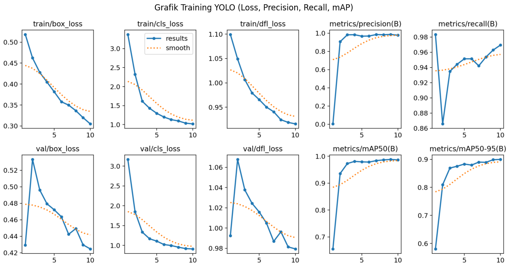

# 🚗🚌🏍️ YOLOv8 Vehicle Object Detection

---

## 🖼️ Sample Output

**Short description:**  
Object detection project using YOLOv8 to detect vehicles (Car, Bus, Motorbike) with bounding boxes and confidence scores.

---

## 🔎 Project Overview
This project implements a YOLOv8-based object detection model to identify three types of vehicles:
- Car
- Bus
- Motorbike

The project was developed as part of the **Artificial Intelligence (UTS)** assignment.

---

## 📊 Dataset
- **Source:** Vehicle Object Dataset (YOLO format)
- **Train Images:** 2,062  
- **Validation Images:** 873  

### Class Mapping
| Class ID | Label |
|--------|------|
| 0 | Bus |
| 1 | Car |
| 2 | Motorbike |

⚠️ Note: Dataset originally contained 6 classes, but only 3 were used.

---

## 🧹 Data Preprocessing
- Filtered unused class IDs
- Verified image–label consistency
- YOLO format (`.txt`) used directly
- Preprocessing handled automatically by YOLOv8

---

## 🧠 Model & Method
- **Algorithm:** YOLOv8 Nano
- **Framework:** Ultralytics
- **Epochs:** 10
- **Image Size:** 640×640
- **Batch Size:** 16

---

## 📈 Training Results

Metrics evaluated:
- Precision
- Recall
- mAP@0.5
- mAP@0.5:0.95

---

## 🖼️ Detection Results
Bounding boxes with confidence scores are visualized on validation images.

---

## 🛠 Tools
- Python
- YOLOv8 (Ultralytics)
- Matplotlib
- Google Colab

---

## ✅ Conclusion
The YOLOv8 model successfully detects three vehicle classes with good accuracy. Minor misclassification (e.g., van detected as bus) is likely caused by dataset labeling rather than implementation errors.
